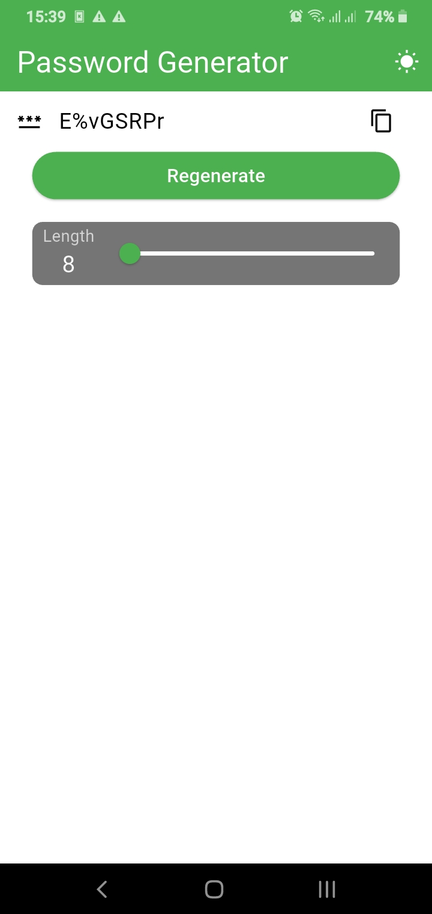
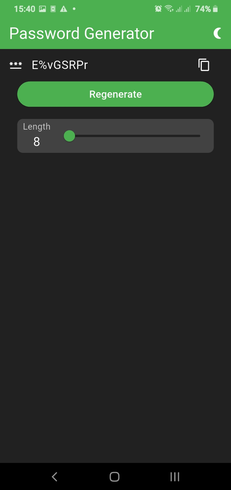

# Password Generator

A simple password generator app built with Flutter.

## Features

- Generate random passwords
- Change password length
- Copy passwords to clipboard
- Generate a password automatically when the app starts
- Supports letters, numbers, and symbols
- Dark mode support

## Screenshots

| Light Mode | Dark Mode |
|---|---|
|  |  |

## Getting Started

Clone the repository:

```bash
git clone https://github.com/TunarAlasgarzade/password_generator.git
```

Install dependencies:

```bash
flutter pub get
```

Run the app:

```bash
flutter run
```

## Built With

- Flutter
- Dart
- shared_preferences
- provider